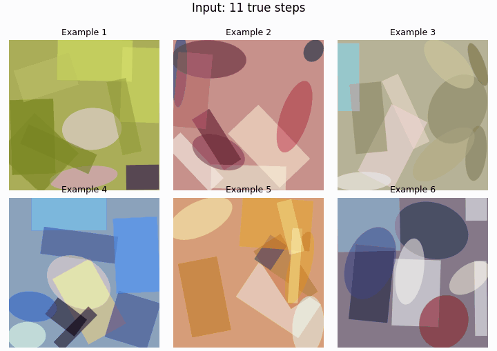

# Primitive Operation Painter

Primitive Operation Painter explores image generation as an explicit,
human-readable drawing process. Instead of emitting pixels or latent variables
directly, the model builds an image one primitive operation at a time.



Six bundled 11-step inputs are shown in a 3-column × 2-row grid for three
seconds, then the model adds one primitive at a time until every sample reaches
144 steps. The animation is a rendering of the model's operation history, not
a pixel-space interpolation.

## Why primitive operations?

Most image generators expose a prompt and a final image, while the intermediate
process is difficult to inspect, explain, or take over. This project asks a
different question: can an image model draw through a representation that a
person can read and modify while it is working?

Here, a canvas is a sequence of background, ellipse, and rotated-rectangle
operations. Each operation has an explicit centre, angle, width, height, shape
type, and RGB colour. The model predicts these values autoregressively rather
than directly changing pixels. A completed image is therefore also a drawing
history: a concrete list of operations that can be rendered, inspected, or
edited at the operation level.

### Human and model co-creation


The top path shows the model completing an initial set of primitives on its
own. The bottom path shows the intended collaboration loop: a person changes a
visible operation in the prefix, then the model continues from that modified
history. This makes the intervention part of the model's actual input rather
than a post-hoc pixel edit.

The representation is directly editable; this repository currently provides
the sequence format, inference, rendering, and training code needed to study
that workflow. It does **not** yet provide a polished graphical editor or a
general guarantee that a particular manual edit will produce a particular
semantic outcome.

## How the pipeline works

1. **Decompose images.** The Rust/WGPU `fast_shape_render` converter
   approximates training images with primitive drawing operations and writes
   the CSV format consumed by the Python data loader.
2. **Encode operations.** Every drawing step is represented by nine discrete
   tokens: x, y, angle, width, height, shape type, and RGB colour.
3. **Predict the next operation.** The GPT model reads the preceding operation
   history and autoregressively predicts the next primitive field by field.
4. **Render, inspect, and continue.** Decoded tokens reproduce a canvas. A
   person can provide or alter an operation prefix, and the model can complete
   the remaining sequence from that state.

## Current scope and limitations

This repository contains the files required to use and continue training the
released **144-step** model: the model definition, token layout, full-sequence
data encoder, training entry point, renderer, GPU image-to-sequence converter,
and a six-sequence inference example.

- It is an operation-sequence model, not a prompt-to-image system or a
  pixel-level image editor.
- Its output uses a finite sequence of simple primitives. This supports
  coarse structure, colour blocks, and an inspectable drawing history, but it
  does not replace a high-fidelity texture or detail renderer.
- The bundled example starts with eleven true operations and asks the model to
  complete the remaining 133 operations. It demonstrates the protocol; it is
  not a training dataset.
- Training data, model weights, resumable checkpoints, historical migration
  scripts, and generated local results are intentionally excluded from the
  code repository.

## License and data boundary

The code and released EMA inference weights are intended to be licensed under
[MIT](LICENSE). Training data is not included or redistributed. Anyone using
this project is responsible for confirming they have the necessary rights for
their own input and training data.

## Setup

Use Python 3.10 or later and install a PyTorch build suitable for your system,
then install the remaining dependencies:

```powershell
python -m pip install -r requirements.txt
```

Set the training-data root with `ANIME_PAINTER_DATA_DIR`, or generate it with
the bundled `fast_shape_render` converter. Its default output directory is
`data/output_256`, which is also the Python programs' default data location.
The data root must contain versioned CSV directories such as `v1/*.csv`.

```powershell
$env:ANIME_PAINTER_DATA_DIR = 'D:\datasets\output_256'
python train_gpt_pretrain.py
```

## Convert an image dataset to training sequences

`fast_shape_render` is a separate Rust/WGPU GPU converter. It resizes each
input image to 256×256, approximates it with primitive drawing operations, and
writes the CSV sequence layout consumed by the Python dataset loader.

Install the Rust toolchain, then set the input directory before running it.
The converter requires a hardware GPU: DirectX 12 on Windows, Vulkan on Linux,
and Metal on macOS. Its default output is `data/output_256`; no personal path
is embedded in the converter.

```powershell
$env:SHAPE_RENDERER_INPUT_DIR = 'D:\images\faces_256'

Push-Location fast_shape_render
cargo run --release
Pop-Location
```

Optional environment variables:

- `SHAPE_RENDERER_OUTPUT_DIR` — use a different CSV output root.
- `SHAPE_RENDERER_NUM_VERSIONS` — number of output variants; defaults to 10.
- `SHAPE_RENDERER_MAX_OUTPUT_STEPS` — optionally retain a fixed number of
  CSV rows per image, including its background row. When set, conversion fails
  if an image has too few accepted primitives to fill the requested sequence.
- `SHAPE_RENDERER_IMAGES_PER_GPU_BATCH` and
  `SHAPE_RENDERER_HISTORY_READBACK_IMAGES` — reduce these if GPU memory is
  limited.

After conversion, either use the default `data/output_256` location or point
training and visualization to a custom output root with
`ANIME_PAINTER_DATA_DIR` or `--data-dir`.

## Six-sequence inference example

The repository includes six compact example sequences under
`example/sequences/v1/data_part_1.csv`. Each one has eleven
steps: a background operation followed by ten primitives. They are a quick
inference demonstration, not training data: the released trainer requires
complete 144-step sequences.

Download or copy the complete model package into a `model` folder at the
project root. Keep both package files directly inside that folder:

```text
primitive_operation_painter/
├── example/
│   └── sequences/v1/data_part_1.csv
├── model/
│   ├── config.json
│   └── model.safetensors
└── example.py
```

The `model/` folder is ignored by Git, so the weight is never added to the
code repository. With this layout, run the demonstration without arguments:

```powershell
python example.py
```

It renders a two-column, six-row PNG. The left side shows the eleven input
operations; the right side starts from those same eleven operations and
samples the remaining 133 steps to make a complete 144-step sequence. If
`model/`, `config.json`, or `model.safetensors` is missing, `example.py`
prints the expected location and exits before it tries to load or download a
model.

To use a model package stored elsewhere, override the default explicitly:

```powershell
python example.py `
  --model-dir path\to\primitive-operation-painter-weight
```

By default the result is written to
`example/example_inference.png`. Use `--csv-path`, `--output-path`, `--seed`,
or `--device` to override the example inputs and inference settings.

## Recreate the autoregressive animation

Recreate the tracked README animation with the same local model package and
seed:

```powershell
python example.py `
  --gif-output example\autoregressive_prediction.gif
```

Use `--gif-fps` to change the prediction-frame rate; the input hold is always
three seconds.

Both `example.py` and `visualize.py` use the same field-aware sampling
schedule. For each generated token, temperature and `top_k` are evaluated as
`a * step + b` from `GPT_SAMPLING_CONFIG`; `step` is the one-based drawing
operation index, including the background operation. `top_k` is rounded down
to an integer and clipped to the current field's valid token range.

## Local visualization

`visualize.py` requires a local model package and a CSV data root. It never
falls back to a personal absolute path or silently selects a checkpoint.

```powershell
python visualize.py `
  --model-dir path\to\primitive-operation-painter-weight `
  --data-dir D:\datasets\output_256 `
  --num-tests 8
```

## Continue training the released weight

Place or download the model package in a local directory containing
`config.json` and `model.safetensors`, then point the trainer at your own CSV
dataset and that directory:

```powershell
$env:ANIME_PAINTER_DATA_DIR = 'D:\datasets\output_256'
python train_gpt_pretrain.py `
  --initial-model-dir path\to\primitive-operation-painter-weight
```

The trainer validates that the package is the compatible 144-step model before
loading its EMA weights. New resumable training checkpoints are written to
`checkpoints_gpt_fullseq_144ctx_256reso/`. On later runs, omit
`--initial-model-dir` to resume from the newest local training checkpoint.
